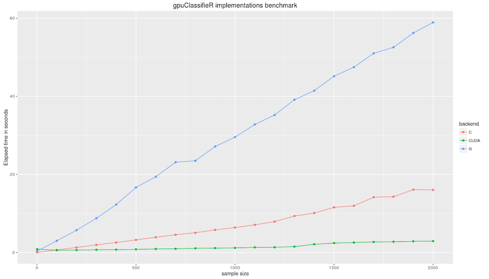
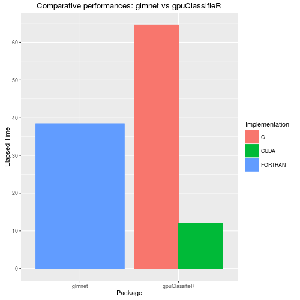

# Playing with MNIST

MNIST is a collection of handwritten digits, in matrix form, along with their corresponding labels. It is, or actually was, the standard dataset for benchmarking classification algorithms. The package contains a subset of MNIST creatively called mini-MNIST.
Let us fit and asses gpuClassifierR performances using mini-MNIST.

## Loading data
Let us first load and organize the dataset

```r
library(gpuClassifieR)
data(mini_mnist)
train_feats <- mini_mnist$train$images
train_targets <- mini_mnist$train$labels
test_feats <- mini_mnist$test$images
test_targets <- mini_mnist$test$labels
M <- NCOL(train_feats)  ## Number of features
K <- NCOL(train_targets)  ## Number of targets.
w_init <- mat.or.vec(M, K)
```

### Benchmark function
We start by defining our benchmark functions. To stay consistent we fix the training iterations to 1000 and disregard convergence.

```r
benchmark_fun <- function(n_sample, feats, targets, decay=0.0, maxiter=1000) {
    w_init <- mat.or.vec(NCOL(feats), NCOL(targets))
    models <- lapply(list(R=w_init, C=w_init, CUDA=w_init), Classifier)
    time <- mapply(function(X, Y) system.time(train(X, feats[1:n_sample,, drop=FALSE],
                                                    targets[1:n_sample,, drop=FALSE],
                                                    decay, 0.01, maxiter,
                                                    FALSE, -1, Y))[['elapsed']]
                 , X=models, Y=names(models),
                   SIMPLIFY=FALSE)

}
```

## Running the benchmark
We combine the training and test sets to get 2000 points. We then time each training and repeatedly increment training examples count by 100 up to 2000. We fix the number of iterations at 1000 and disregard gradient convergence.

 

## Benchmark against glmnet
Let's compare the performance of our C implementation against glmnet. We'll by timing how much times it takes for glmnet to get a grid of optimal decay coefficients. We will then time our code on the provided grid. We step the maximum number of iterations to 100 for both glmnet and our implementation.

 