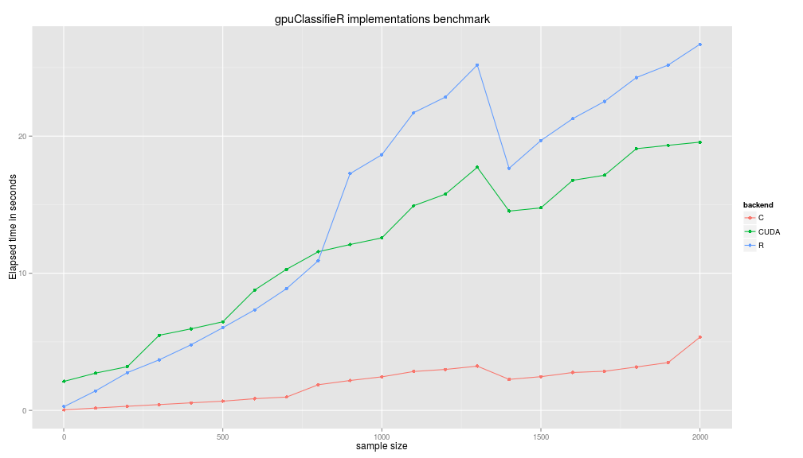
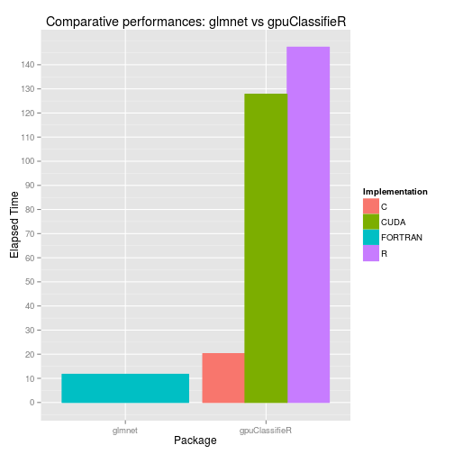

# Introduction

The gpuClassifierR package implements a multi-class L2 regularized logistic regression along with a batch gradient trainer. Both the model and the trainer have an R, C and CUDA implementation. Several choices were made to increase the efficiency of the package, for example:

- Extensive use of BLAS and cuBLAS when appropriate.
- Data in C was represented in a way to limit cache misses (Which is bound to happen considering the large scale problems this package aims to handle).
- Routines were natively registered to minimize compiled code running time.
- The .Call interface was preferred. Benchmarks show that it usually (albeit slightly) faster than .C.

Moreover, to ensure the robustness of the package:

- Unit tests were used to check the consistency of core functions amongst all implementations.
- Special care has been taken with error handling in C and CUDA code.
- Repeated use Valgrind and gpumemcheck to ensure the absence of memory leaks as well as extensive garbage collection tests.

# Playing with MNIST

MNIST is a collection of handwritten digits, in matrix form, along with their corresponding labels. It is, or actually was, the standard dataset for benchmarking classification algorithms. The package contains a subset of MNIST creatively called mini-MNIST.
Let us fit and asses gpuClassifierR performances using mini-MNIST.

## Loading data
Let us first load and organize the dataset


```r
data(mini_mnist)
train_feats <- mini_mnist$train$images
train_targets <- mini_mnist$train$labels
test_feats <- mini_mnist$test$images
test_targets <- mini_mnist$test$labels
M <- NCOL(train_feats)  ## Number of features
K <- NCOL(train_targets)  ## Number of targets.
```
## Specifying models

To fit the model we need to start by specifying one. To do so all it takes is a matrix of initial weights and calling the model constructor on it. Please note that the targets need to be in one hot encoding.
Since we have three implementation let us specify three models but with the same initial weights.


```r
w_init <- mat.or.vec(M, K)
models <- list(R=w_init, C=w_init, CUDA=w_init)
models <- lapply(models, Classifier)
```
## Setting training variables
Once the model has been specified all it takes is calling the train method on it along with the training data.

Let us start by laying out the model parameters

```r
step_size <- 0.01  ## Initial step size
decay <- 0.0  ## Tikhonov regularization coefficients
max_iter <- 10000  ## Maximum number of iterations
verbose <- FALSE  ## TRUE to monitor the evoluation of the step size, cost and
## iterations
tol <- 1e-6  ## The training will consider to have converged if the Frobenius
## norm of the gradient is less than tol
```
## Training the models
Let us now train the three models

```r
models <- mapply(function(X, Y) train(X, train_feats,
                                      train_targets, decay,
                                      step_size, max_iter,
                                      verbose, tol, Y), X=models, Y=names(models),
                 SIMPLIFY=FALSE)
```
## Checking gradient for convergence
Now that the models are trained let's ensure that convergence was indeed attained.


|     R|     C|  CUDA|
|-----:|-----:|-----:|
| 1e-06| 1e-06| 1e-06|

## Assessing models predictive performances

Let us now get, both in-sample and out-of-sample, models misclassification rates.

### In sample misclassification rate


|  R|  C| CUDA|
|--:|--:|----:|
|  0|  0|    0|

### Out of sample misclassification rate


|     R|     C|  CUDA|
|-----:|-----:|-----:|
| 0.131| 0.131| 0.131|

1000 examples, 7840 parameters, no regularization. Some over-training was to be expected! Still the model performance are pretty good.
To give a reference point, the current state of the art on the complete MNIST database is held by a committee of 35 convolutional neural networks with an outstanding misclassification rate of 0.23%!

## Timing and benchmarking the implementations
Let us now time the three implementation but for different varying dataset sizes.

### Benchmark function
We start by defining our benchmark functions. To stay consistent we fix the training iterations to 1000 and disregard convergence.


```r
benchmark_fun <- function(n_sample, feats, targets, decay=0.0, maxiter=1000) {
    w_init <- mat.or.vec(NCOL(feats), NCOL(targets))
    models <- lapply(list(R=w_init, C=w_init, CUDA=w_init), Classifier)
    time <- mapply(function(X, Y) system.time(train(X, feats[1:n_sample,, drop=FALSE],
                                                    targets[1:n_sample,, drop=FALSE],
                                                    decay, 0.01, maxiter,
                                                    FALSE, -1, Y))[['elapsed']]
                 , X=models, Y=names(models),
                   SIMPLIFY=FALSE)

}
```

## Running the benchmark
We combine the training and test sets to get 2000 points. We then time each training and repeatedly increment training examples count by 100 up to 2000. We fix the number of iterations at 1000 and disregard gradient convergence.

 


The CUDA implementations can appear disappointing. However, the following points need to be taken into consideration:

- The gpu used for the benchmark is really of the lower tier (geforce 730).
- Since implementations consistency was paramount during the development, the current CUDA code is done with double precision(to stay consistent with the R and C versions). The performance ratio of double against single performance on nvidia gpus ranges from 1/32 for the geforce 700 series to 1/3 for the GTX Titan. The next improvement to gpuClassifieR will be the addition of a single precision mode.
- There is a large overhead with transferring data to the gpu. This overhead becomes insignificant once the sample size is large enough. A 2000 examples dataset is simply too small to benefit from  gpgpu speedup.

## Benchmark against glmnet
Let's compare the performance of our C implementation against glmnet. We'll by timing how much times it takes for glmnet to get a grid of optimal decay coefficients. We will then time our code on the provided grid. We step the maximum number of iterations to 100 for both glmnet and our implementation.

 


glmnet computes the grid in 10.28 seconds. The C implementation of gpuClassifieR goes through the grid in 15.3 seconds. glmnet is 49% faster than the C implementation of gpuClassifieR. Keep in mind that this benchmark is not really rigorous, we are comparing two packages using two different training algorithms. Nevertheless, It is reasonable to expect that gpuClassifieR will get faster. There is still a lot of room for improvement.
